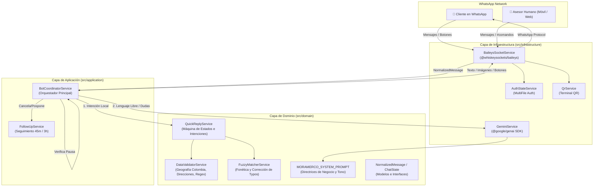
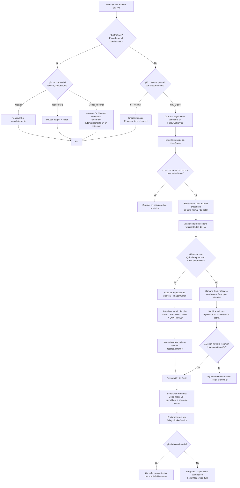

# Arquitectura y Funcionamiento del Chatbot de Ventas - MoraMerco

Este documento detalla la arquitectura de software, el flujo de toma de decisiones, la conexión con Inteligencia Artificial (Google Gemini) y la lógica operativa del bot de ventas de WhatsApp **"Maria Paula"**, desarrollado para el e-commerce y dropshipping de **MoraMerco Colombia**.

---

## 1. Visión General del Sistema

El bot está diseñado para automatizar la atención y el cierre de ventas de la **Base Ajustable de Acero Independiente** (par de barras telescópicas con 24 ruedas y frenos para lavadoras y neveras) a través de WhatsApp, combinando:

1. **Respuestas Rápidas Locales (Cero consumo de tokens)**: Respuestas ultrarrápidas y deterministas para precios, fotos, dudas frecuentes y confirmaciones de pedidos.
2. **Inteligencia Artificial Generativa (Google Gemini)**: Razonamiento fluido, manejo de objeciones complejas y comprensión de lenguaje informal y regional colombiano.
3. **Validación Estricta de Datos de Envío en Colombia**: Extracción y validación de nombres, ciudades, departamentos, teléfonos y direcciones (domicilio o reclamo en oficina de Interrapidísimo).
4. **Protección Anti-Ban y Comportamiento Humano**: Agrupación de mensajes en ráfaga (debounce), pausas de lectura, simulación de estado "escribiendo" y control de intervención humana.
5. **Seguimiento Automatizado**: Recuperación de conversaciones abandonadas dentro del horario comercial colombiano.

---

## 2. Diagrama de Arquitectura de Capas

El proyecto está estructurado bajo principios de **Clean Architecture** (Arquitectura Limpia / Hexagonal) con TypeScript en Node.js (ES Modules):



---

## 3. Estructura de Carpetas del Proyecto

```
ChatBotAI/
├── assets/                          # Recursos estáticos (fotos de producto)
│   ├── fotobase.jpg                 # Fotografía principal enviada a clientes
│   └── base_producto.jpg            # Imagen de respaldo
├── sessions/                        # Credenciales de sesión de WhatsApp (Baileys)
├── src/
│   ├── config/
│   │   └── env.config.ts            # Variables de entorno (.env)
│   ├── domain/                      # Entidades, reglas de negocio e interfaces
│   │   ├── models/
│   │   │   └── message.model.ts     # Modelo unificado de mensaje normalizado
│   │   ├── prompts/
│   │   │   └── store-system.prompt.ts # System Prompt oficial de Maria Paula
│   │   ├── services/
│   │   │   ├── ai-service.interface.ts      # Contrato para servicios de IA
│   │   │   ├── data-validator.service.ts    # Validador de direcciones y municipios COL
│   │   │   ├── fuzzy-matcher.service.ts     # Normalizador fonético y corrector
│   │   │   ├── message-handler.interface.ts # Contratos de entrada y salida
│   │   │   └── quick-reply.service.ts       # Motor local de intenciones y estados
│   ├── application/                 # Casos de uso y orquestación
│   │   └── services/
│   │       ├── bot-coordinator.service.ts   # Coordinador central de eventos y debounce
│   │       └── follow-up.service.ts         # Seguimiento en 45m y 3h
│   ├── infrastructure/              # Adaptadores de tecnologías externas
│   │   ├── ai/
│   │   │   └── gemini.service.ts    # Conexión con Gemini 3.1 Flash Lite / 3.5 Flash
│   │   └── whatsapp/
│   │       ├── auth-state.service.ts    # Persistencia de auth Baileys
│   │       ├── baileys-socket.service.ts# Socket WebSocket y decodificación de mensajes
│   │       └── qr.service.ts            # Generador de QR en consola
│   └── index.ts                     # Punto de entrada / Inyección de dependencias
├── .env                             # Configuración local (GEMINI_API_KEY, etc.)
└── package.json
```

---

## 4. Flujo Detallado de Toma de Decisiones

Cuando un mensaje llega desde WhatsApp, pasa por un pipeline secuencial y estricto dentro de `BotCoordinatorService`:



### 4.1. Ventana de Espera y Debounce (Agrupación de Ráfagas)
Los usuarios en WhatsApp acostumbran escribir en mensajes separados:
* *Mensaje 1:* "Hola buenas"
* *Mensaje 2:* "¿Cuánto vale la base?"
* *Mensaje 3:* "Y sirve para lavadora de 40 kilos?"

Si el bot respondiera a cada uno, generaría 3 respuestas solapadas, gastaría el triple de tokens y parecería un bot tosco.
* `BotCoordinatorService` mantiene un buffer con un temporizador de **9 segundos**.
* Cada mensaje nuevo reinicia el temporizador.
* Si el mensaje es una interacción de botón (ej. `CONFIRMAR`), el temporizador se reduce a **1 segundo**.
* Al agotarse el temporizador, se unen todos los fragmentos con saltos de línea y se evalúan como un solo mensaje coherente.

### 4.2. Control de Intervención Humana (Hand-off Inteligente)
El bot respeta en todo momento la actividad del vendedor humano:
1. **Detección Automática**: Si el dueño o asesor responde al cliente directamente desde su celular o WhatsApp Web (`fromMe === true`), el bot se silencia automáticamente por **2 horas** en ese chat.
2. **Comandos Manuales**:
   * `#pausar` o `#pausar 4`: Silencia el bot por 2 horas (o las horas especificadas).
   * `#activar` / `#reanudar` / `#bot`: Devuelve el control a Maria Paula de forma inmediata.

---

## 5. Máquina de Estados del Cliente (`QuickReplyService`)

El cliente transita por diferentes estados para garantizar que no se le repita información innecesaria:

```
[ NEW ] ─────────► [ AWAITING_APPLIANCE ] ───► [ PRICING_SENT ]
   │                                                 │
   │ (Cliente pide precios/combo directo)           │ (Cliente elige combo o da datos)
   ▼                                                 ▼
[ PRICING_SENT ] ───────────────────────────► [ DATA_REQUESTED ]
                                                     │
                                                     │ (Cliente envía datos válidos)
                                                     ▼
                                            [ CONFIRMATION_PENDING ]
                                                     │
                                                     │ (Cliente confirma pedido)
                                                     ▼
                                             [ ORDER_CONFIRMED ]
```

* **`NEW`**: Contacto inicial. Se presenta como Maria Paula y ofrece las opciones o pregunta por su electrodoméstico.
* **`AWAITING_APPLIANCE`**: El bot preguntó si es para nevera o lavadora y espera la especificación.
* **`PRICING_SENT`**: Precios oficiales presentados (Combo x1 $69.900, Combo Dúo x2 $119.900, Combo Hogar x3 $159.900). Prohibido volver a saludar.
* **`DATA_REQUESTED`**: El cliente eligió producto y se le solicitaron los 4 datos de despacho (Nombre, Ciudad, Dirección, Celular).
* **`CONFIRMATION_PENDING`**: Datos completos y validados. Se muestra el resumen estructurado y se adjunta el botón interactivo de confirmación.
* **`ORDER_CONFIRMED`**: Pedido cerrado. Se cancelan seguimientos y se notifica que entra a despacho con pago contra entrega.

---

## 6. Validación de Datos de Envío (`DataValidatorService`)

El comercio electrónico contra entrega en Colombia tiene particularidades críticas que este servicio resuelve sin gastar llamadas de IA:

1. **Reconocimiento Geográfico Oficial**:
   * Catálogo de los 32 departamentos y principales municipios con cobertura de transportadoras (Interrapidísimo, Coordinadora, Servientrega, Envia).
2. **Doble Modalidad de Entrega**:
   * **A Domicilio**: Reconoce vías urbanas y rurales (`calle`, `carrera`, `diagonal`, `transversal`, `avenida`, `manzana/lote`, `vereda`).
   * **Reclamo en Oficina**: Detecta intenciones como *"para reclamar en oficina de Interrapidísimo"*, ajustando la confirmación para entrega en sucursal.
3. **Lista Negra Anti-Alucinación (`BLACKLISTED_NAME_WORDS`)**:
   * Evita confundir palabras como *"Interrapidísimo"*, *"Lavadora"*, *"Costo"* o *"Buenas"* con el nombre del cliente.
4. **Respuestas a Dudas Simultáneas**:
   * Si el cliente envía sus datos pero al mismo tiempo pregunta algo (ej. *"Calle 10 # 5-20 Neiva, Pedro Perez 3101234567, pero si aguanta la lavadora?"*), el validador responde la duda técnica en el encabezado y aprueba los datos en la misma respuesta.

---

## 7. Conexión e Integración con Inteligencia Artificial (Google Gemini)

La IA está encapsulada en `GeminiService` mediante el SDK oficial `@google/genai`:

### 7.1. Modelo Principal y Mecanismo de Fallback
* **Modelo Principal**: `gemini-3.1-flash-lite` (optimizado para latencia ultrabaja y costos mínimos en producción).
* **Modelo de Contingencia Automático**: Si la API de Google responde con código `503`, `429` (saturación) o `500`, el servicio conmuta en tiempo real a `gemini-3.5-flash` sin interrumpir la experiencia del usuario.
* **Modo Contingencia Offline**: Si no hay `GEMINI_API_KEY` configurada o falla la red, el sistema responde con una plantilla comercial de respaldo con precios y beneficios.

### 7.2. Inyección Dinámica del Contexto y System Prompt
En cada llamada a Gemini, se inyecta:
1. **`MORAMERCO_SYSTEM_PROMPT`**:
   * Tono colombiano (amable, cercano, persuasivo: *"pille pues"*, *"para trapear sabroso"*, *"en un dos por tres"*).
   * Información técnica fidedigna: **2 barras independientes con 24 ruedas y frenos**, elevan **4 cm**, soportan electrodomésticos pesados y centrifugado. Prohibido decir que es una plataforma cuadrada.
   * Tabla de precios y ahorro de combos.
   * Regla de brevedad: **2 a 4 líneas por mensaje**.
2. **Instrucción de Saludo Único**:
   * Si la conversación ya tiene mensajes previos, se añade dinámicamente:
     > `[INSTRUCCIÓN CRÍTICA]: Esta conversación YA ESTÁ EN CURSO. El cliente YA fue saludado. ¡ESTRICTAMENTE PROHIBIDO decir "¡Hola! Soy Maria Paula..." o volver a saludar!`
3. **Filtro Post-Procesamiento (Sanitización por Regex)**:
   * Si el modelo genera algún saludo residual en una charla activa, una expresión regular lo elimina antes de enviar el mensaje al cliente.

### 7.3. Gestión del Historial Conversacional (`conversationHistory`)
* Se almacena en memoria un historial de turnos `user` y `model`.
* Se aplica una ventana deslizante de **últimos 8 mensajes (4 turnos)** para controlar el consumo de tokens manteniendo el contexto inmediato.
* Cuando el bot responde mediante una **plantilla rápida local** (QuickReply), ejecuta `recordExchange()` para registrar ese intercambio en el historial de Gemini. Así, cuando el usuario haga una pregunta libre después, Gemini sabrá qué oferta o combo se le envió antes.

---

## 8. Estrategia de Envío de Mensajes y Anti-Ban en WhatsApp

`BaileysSocketService` aplica buenas prácticas para garantizar entregabilidad y evitar bloqueos por parte de WhatsApp:

| Técnica | Implementación |
| :--- | :--- |
| **Desduplicación de Mensajes** | Almacena los IDs de los mensajes emitidos por el bot para ignorarlos en el evento `messages.upsert` y evitar bucles infinitos. |
| **Presencia Realista** | Emite `sendPresenceUpdate('composing')` antes de cada respuesta. |
| **Tiempo de Escritura Proporcional** | Pausa dinámica calculada según los caracteres del texto: `Math.min(Math.max(length * 20, 1500), 3500)`. |
| **Botones Interactivos Compatibles** | Implementados mediante **WhatsApp Native Polls** (encuestas de 1 sola selección), garantizando que se rendericen en el 100% de dispositivos iOS, Android y WhatsApp Web. |
| **Texto de Respaldo Siempre** | Los mensajes con botón envían primero el resumen completo en texto plano para asegurar la lectura en caso de clientes con versiones antiguas de WhatsApp. |

---

## 9. Sistema de Seguimiento Automático (`FollowUpService`)

Recupera ventas de clientes que dejaron de responder:
* **Etapa 1 (45 minutos después):** Mensaje cordial consultando si le quedó alguna duda técnica sobre las medidas o el centrifugado.
* **Etapa 2 (3 horas después):** Notificación de que bodega está organizando los despachos del día para apartar su cupo con Envío Gratis.
* **Reglas de Seguridad:**
  1. Se cancela inmediatamente si el cliente envía cualquier mensaje (`onCustomerReplied`).
  2. Se apaga definitivamente si el pedido se confirma (`markOrderCompleted`).
  3. **Horario Comercial:** Solo dispara mensajes entre las **8:00 AM y las 8:30 PM (Hora de Colombia)**. Si vence de noche, se suspende.
